# Referees Management System

## Contents
- [Team](#team)
- [Vision and Scope](#vision-and-scope)
- [Requirements](#requirements)
    - [Use case diagram](#use-case-diagram)
    - [Mockups](#mockups) 
    - [User stories and prototypes](#user-stories-and-prototypes)
- [Definition of done](#definition-of-done)
- [Architecture and Design](#architecture-and-design)
    - [Domain Model](#domain-model)
- [Risk Plan](#risk-plan)
- [Pre-Game](#pre-game)
    - [Sprint 0 Plan](#sprint-0-plan)
- [Release Plan](#release-plan)
    - [Release 1](#release-1)
    - [Release 2](#release-2)
- [Increments](#increments)
    - [Sprint 1](#sprint-1)
    - [Sprint 2](#sprint-2)
    - [Sprint 3](#sprint-3)

***

## Vision and Scope

#### Problem Statement
##### Project background

As a referee, one of the challenges I encounter is the complexity of managing referee assignments for games. Currently, this process involves sending messages, waiting for responses, manually organizing assignments, and notifying referees via email. This becomes confusing when dealing with a large number of registered referees.

##### Stakeholders

- Managers/Directors of Sports Associations
- Referees
- Project developers

##### Users

- Referee: They should be able to edit personal information, check their personal rating and set their availability.
- Manager : System manager who have the responsibility of managing the referees and matches.

***

#### Vision & Scope of the Solution

##### Vision statement

To tackle this problem, we intend to develop an application to make it easier to manage the selection of referees for upcoming matches which will have information about the time, location and date of each one, as well as available time slots of the referees registered on the app.

##### List of features

- Manage games
  - The manager can add, modify and delete games to the system
- Manage availability time slots
  - The referee can indicate their time slots when they are available to officiate games.
- Adding a Rating to a finalized game in order to rate the referee’s performance
  - The manager can add a rating (1-5, higher is better) to a finalized game to evaluate the referee’s performance.
- Manage referees
  - The manager can add, modify and delete referees to the system
  - Payment system for Referee

##### Features that will not be developed
 

##### Risk

- Difficulty in obtaining the full participation of all referees and sports associations in adopting the application.
- Changes in sports regulations that affect the application's requirements.

##### Assumptions

- Access to a computer.
- Referees and sports associations will be willing to adopt the application.
- The information provided by referees and sports associations is accurate and up-to-date.
- The current sports regulations will remain stable during the development of the application.

***

## Requirements

#### Use Case Diagram

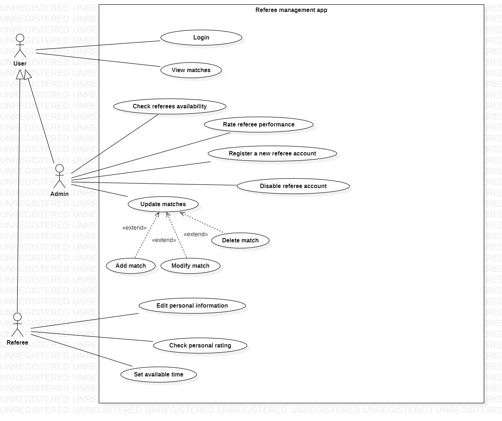

***

### Mockups

##### Login Form

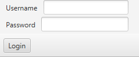

##### Referee Panel

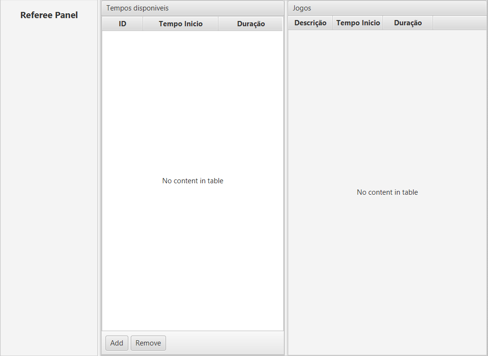

##### Manager Panel

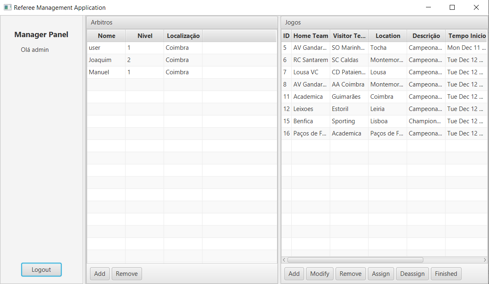

##### Add Match

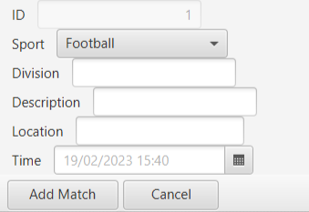

##### Modify Match

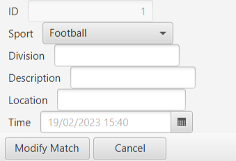

##### Delete Match

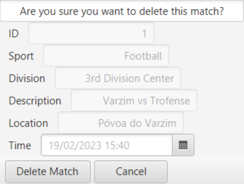

##### Rate Referee

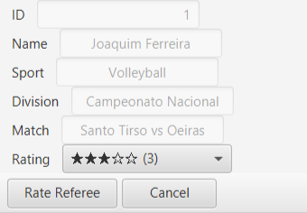

##### Register Referee

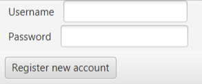

##### Disable Referee

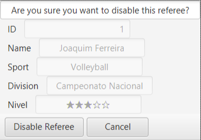

##### Assign Referee

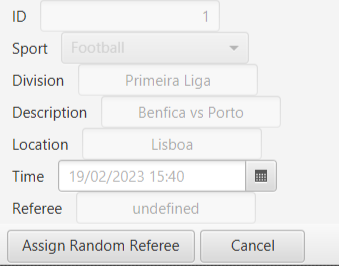

##### Remove Referee

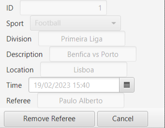

##### Referee Payment - Manager

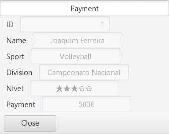

##### Referee Payment - Referee

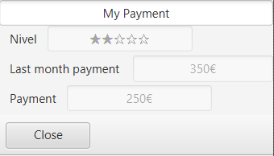

***

##### Use Case 1 - Login
- Actor: User
- Description: As an user I want to login in the app
- Preconditions:
  - Have a registered account
- Postconditions:
  - The user is successfully logged into the app.
- Normal flow:
  - The user opens the application on their device.
  - The app displays a login screen, prompting the user to enter their credentials.
  - The user enters their valid username and password.
  - The app verifies the provided credentials against the stored user data.
  - If the credentials are correct, the app logs the user in.
  - The user now has access to the app's features.
- Alternative flows:
  - If the app detects that the provided credentials are incorrect, it displays an error message to the user, indicating that the login was unsuccessful.
***

##### Use Case 2 - View matches
- Actor: User
- Description: Viewing matches in the application
- Preconditions:
  - The user is logged into the app.
  - There are matches available for the user to view.
- Postconditions:
  - The user can see the list of matches.
  - The user can access detailed information about each match.
- Normal flow:
  - The user is logged into the application.
  - The user navigates to the matches section within the app.
  - The app displays a list of available matches, which may include upcoming matches.
  - The user can scroll through the list to view basic information about each match, such as team names, date, time, and location.
- Alternative flows:
  - No alternative flows

***

##### Use Case 3 - Check referees availability
- Actor: Manager
- Description: Checking referees' availability
- Preconditions:
  - The manager has the necessary access rights within the application.
  - Referees' availability data is stored in the application.
- Postconditions:
  - The Manager can view the availability status of referees.
- Normal flow:
  - The Manager opens the application and goes to the referees availability section.
  - The app displays the availability status of the referees.
- Alternative flows:
  - No alternative flows

##### Use Case 4 - Rate referee perfomance
- Actor: Manager
- Description: Rating a referee's performance in a match
- Preconditions:
  - The Manager has the necessary access rights within the application.
  - A match with a referee's performance to rate has been recorded in the application.
- Postconditions:
  - The Manager's rating on the referee's performance are recorded in the system.
- Normal flow:
  - The Manager opens the application and navigates to the matches section.
  - The app displays a list of matches.
  - The Manager selects the specific match they want to rate the referee for.
  - The Manager provides a rating.
  - The app records the Manager's rating in the system, associating it with the specific referee.
- Alternative flows:
  - No alterantive flows

##### Use Case 5 - Register a new referee account
- Actor: Manager
- Description: Creating new referee accounts
- Preconditions:
  - The Manager has the necessary access rights within the application.
  - The Manager has access to the account creation functionality.
- Postconditions:
  - One or more new referee accounts are successfully created and added to the system.
- Normal flow:
  - The Manager opens the application and clicks on the "add" button.
  - The app displays a form or fields for the Manager to enter the necessary information for the new referee accounts.
  - The Manager fills in the required information for the new referee account.
  - If the entered data is valid, the app creates the new referee account(s) and stores them in the system's database.
- Alternative flows:
  - If the Manager provides invalid or incomplete data for creating a new referee account, the app should display error messages indicating the issues that need to be corrected.
  - If the Manager attempts to create a new account with a username that is already in use, the app should prompt the Manager to choose a different, unique username.

##### Use Case 6 - Disable Referee Account
- Actor: Manager
- Description: Disable a referee's account
- Preconditions:
  - The Manager has the necessary access rights within the application.
  - The referee's account to be disable exists in the system.
- Postconditions:
  - The referee's account is disabled from the system.
- Normal flow:
  - The Manager opens the application.
  - The app provides a list of referees' accounts.
  - The Manager selects the specific referee account they want to disable.
  - The app may prompt the Manager to confirm the deletion to prevent accidental disable.
  - After confirmation, the app disables the referee's account from the system.
- Alternative flows:
  - No alterantive flows


##### Use Case 7 - Set Available Time
- Actor: Referee
- Description: This function describes the process by which the referee shows them the available time in the application, which determines when they are free to manage the game.
- Preconditions:
  - The Referee has an account in the application.
  - Referee is logged into the application.
- Postconditions:
  - The user's available time slots are successfully updated in the application.
- Normal flow:
  - The user is logged into the application.
  - The user navigates to the "Set Available Time" section of their profile.
  - The application presents a calendar for selecting available time slots.
  - The user specifies their available time slots by selecting dates and times when they are free to officiate games.
  - The user saves the selected time slots.
  - The application validates and updates the user's available time
- Alternative flows:
  - If the user encounters a scheduling conflict or needs to change their available time slots, they can go back to the "Set Available Time" section and modify their selections. The application will update the information accordingly.
- Exception Flow:
  - If there is a technical problem or an error in the available time being displayed, the application may display an error message and advise the user to try again later. If the problem persists, the user can also contact support for help.

##### Use Case 8 - Check Personal Rating
- Actor: Referee
- Description: This use case describes the process by which a referee can check their personal rating within the application, which reflects their performance in previous games.
- Preconditions:
  - The Referee has an account in the application.
  - Referee is logged into the application.
- Postconditions:
  - The referee can view their personal rating within the application.
- Normal flow:
  - The user is logged into the application.
  - TThe referee navigates to their profile.
  - The application displays the referee's personal information, including their rating.
  - The referee can see their rating, which is typically displayed as a numerical value.
  - The user saves the selected time slots.
  - The application validates and updates the user's available time
- Alternative flows:
  - If the referee wants to see specific details about their recent ratings and comments, they can access a dedicated section in their profile that provides a history of ratings and feedback received for each game they officiated.
- Exception Flow:
  - If there is a technical issue or error in displaying the rating, the application may display an error message and advise the referee to try again later. If the problem persists, the referee can contact support for assistance.

##### Use Case 9 - Edit Personal Information
- Actor: Referee
- Description: This use case describes the process by which a referee can edit their personal information in the application.
- Preconditions:
  - The Referee has an account in the application.
  - Referee is logged into the application.
- Postconditions:
  - The referee's personal information is successfully updated in the application.
- Normal flow:
  - The user is logged into the application.
  - The referee navigates to the "Edit Personal Information" section of their profile.
  - The application presents a form with the referee's current personal information.
  - The referee can edit and update the following personal information:
    - Full Name
    - Contact Information(email, phone number)
- Alternative flows:
  - If the referee needs to change additional personal information, they can go back to the "Edit Personal Information" section and make further edits. The application will update the information accordingly.
- Exception Flow:
  - If there are technical issues or errors during the process of editing personal information, the application may display an error message and advise the referee to try again later. The referee can also contact support for assistance if the issue persists.

##### Use Case 10 - Add Match
- Actor: Manager
- Description: This use case describes the process by which an Manager adds a new match to the application's database, including details about the match's date, time, location, and description.
- Preconditions:
  - The Manager has an account in the application.
  - The Manager has the necessary permissions to add matches.
- Postconditions:
  - The new match information is successfully added to the application's database and is available for assignment.
- Normal flow:
  - The Manager is logged into the application.
  - The Manager navigates to "Match" and go "Add" section.
  - The application presents a form for entering match details.
  - The Manager specifies the following match details:
    - Date
    - Start Time
    - End Time
    - Location
    - Description
  - The Manager saves the match information.
  - The application validates the entered match details and stores them in the application's database.
  - The new match is now available for assignment and appears in the list of matches.
- Alternative flows:
  -If during the process of adding a match, the application detects that the entered match details are incomplete or invalid, it will prompt the Manager to correct the information
- Exception Flow:
  - If there are technical issues or errors during the process of adding a match, the application may display an error message and advise the Manager to try again later. The Manager can also contact support for assistance if the issue persists.

##### Use Case 11 - Modify Match
- Actor: Manager
- Description: This use case describes the process by which the Manager can modify the details of a match within the application.
- Preconditions:
  - The Manager is logged into the application.
  - The match to be modified exists in the application's database.
- Postconditions:
  - The match details are successfully updated with the new information.
- Normal flow:
  - The Manager is logged into the application.
  - The Manager navigates to the "Modify Match" section.
  - The application displays a list of matches that can be modified.
  - The Manager selects a specific match from the list.
  - The application presents a form or interface for modifying match details.
  - The Manager updates the match details, which may include:
    - Date
    - Time
    - Location
    - Assigned Referee
  - The Manager saves the modifications.
  - The application validates and updates the match.
- Alternative flows:
  - If the Manager needs to modify multiple matches, they can repeat steps 4 to 7 for each match. The application will update the information for each match accordingly.
- Exception Flow:
  - If there are technical issues or errors during the process of modifying match details, the application may display an error message and advise the Manager to try again later. If the problem persists, the Manager can contact support for assistance.


##### Use Case 12 - Delete Match
- Actor: Manager
- Description: This use case describes the process by which an Manager deletes a match from the application, updating the game schedule.
- Preconditions:
  - The Manager is logged into the application.
  - The Manager has appropriate permissions to delete matches.
- Postconditions:
  - The selected match is successfully removed from the game schedule.
- Normal flow:
  - The Manager is logged into the application with appropriate permissions.
  - The Manager navigates to the "Delete Match" section or accesses the list of scheduled matches.
  - The application presents a list of scheduled matches for deletion.
  - The Manager selects the match they want to delete.
  - The application prompts for confirmation to ensure that the match is to be deleted.
  - The Manager confirms the deletion.
  - The application updates the game schedule, removing the selected match.
- Alternative flows:
  - No alternative flow
- Exception Flow:
  - If there are technical issues or errors during the match deletion process, the application may display an error message and advise the Manager to try again later. The Manager can also contact support for assistance if the issue persists.

##### Use Case 13 - Update Matches
- Actor: Manager
- Description: This use case describes the process by which the Manager updates the list of matches in the application, including adding new games, modifying existing ones, or removing outdated matches.
- Preconditions:
  - The Manager is logged into the application.
  - The Manager has the necessary permissions to manage matches.
- Postconditions:
  - The list of matches in the application is successfully updated, reflecting any changes made by the Manager.
- Normal flow:
  - The Manager is logged into the application.
  - The application displays a list of existing matches, along with options to add new games, edit existing matches, or remove outdated ones.
  - If the Manager wants to add a new game, they select the "Add" option.
  - The Manager provides details for the new game, including the date, time, location, and other relevant information.
  - The application validates the provided information and adds the new game to the list.
  - If the Manager wants to edit an existing match, they select the "Edit Match" option.
  - The Manager makes the necessary changes to the match details.
  - The application validates the changes and updates the match information.
  - If the Manager wants to remove an outdated match, they select the "Remove" option.
  - The application confirms the removal of the selected match.
  - The application removes the outdated match from the list.
- Alternative flows:
  - If there are any conflicts or errors in the data provided for a new game or changes to an existing match, the application may display an error message and prompt the Manager to correct the information.
- Exception Flow:
  - If there are technical issues or errors during the process of updating matches, the application may display an error message and advise the Manager to try again later. The Manager can also seek assistance from support if needed.

***

### User Stories
- [User story 1](#user-story-1)
- [User story 2](#user-story-2)
- [User story 3](#user-story-3)
- [User story 4](#user-story-4)
- [User story 5](#user-story-5)
- [User story 6](#user-story-6)
- [User story 7](#user-story-7)
- [User story 8](#user-story-8)
- [User story 9](#user-story-9)
- [User story 10](#user-story-10)
- [User story 11](#user-story-11)
- [User story 12](#user-story-12)
- [User story 13](#user-story-13)
- [User story 14](#user-story-14)
- [User story 15](#user-story-15)

***

## Definition of done

(This section is already written, do not edit)
It is a collection of criteria that must be completed for a User Story to be considered “done.”

1. All tasks done:
  - CI – built, tested (Junit), reviewed (SonarCloud)
  - Merge request to qa (code review)
2. Acceptance tests passed
3. Accepted by the client
4. Code merged to main

***

##### User Story 1
As an User, I want to be able to easily login on the application, so I can start using the system.

Story points: S

MoSCoW: Must Have

###### Acceptance Criteria

```
- The application should provide a login form.
- The login form should have fields for the user to enter their username and password.
- The application should verify the provided credentials.
- If the credentials are correct, the user should be logged in.
- If the credentials are incorrect, the user should be displayed an explicit error message.
```

###### Prototype
- [Login Form](#login-form)

***

##### User Story 2
As a Referee, I want to update my availability by specifying time slots when I am free to officiate matches, so the system can assign me to suitable games.

Story points: S

MoSCoW: Must Have

###### Acceptance Criteria

```
- The application should provide a form for the user to specify their available time slots.
- The user should be able to select multiple time slots.
- The application should validate and store/update the selected time slots.
```

###### Prototype
- [Update Availability](#referee-panel)

***

##### User Story 3
As a Manager, I want to be able to add matches to the system.

Story points: S

MoSCoW: Must Have

###### Acceptance Criteria

```
- The application should provide a form for the Manager to enter the match details.
- The match details should include the sport, division, date and time, location, and description.
- The application should validate and store the match details.
```

###### Prototype
- [Add match](#add-match)

***

##### User Story 4
As a Manager, I want to be able to modify upcoming matches in the system, so I can manage the game.

Story points: S

MoSCoW: Must Have

###### Acceptance Criteria

```
- The application should provide a list of upcoming matches.
- The Manager should be able to select a specific match from the list.
- The application should provide a form for the Manager to modify the match details.
- The match details should include the sport, division, date and time, location, and description.
- The application should validate and update the match details.
```

###### Prototype
- [Modify Match](#modify-match)

***

##### User Story 5
As a Manager, I want to be able to remove matches from the system.

Story points: S

MoSCoW: Must Have

###### Acceptance Criteria

```
- The application should provide a list of upcoming matches.
- The Manager should be able to select a specific match from the list.
- The application should prompt the Manager to confirm the deletion.
- The application should remove the selected match from the system on confirmation.
```

###### Prototype
- [Delete Match](#delete-match)

***

##### User Story 6
As a Referee, I want to be able to view the upcoming matches, so I can make informed decisions when marking time slots as available.

Story points: S

MoSCoW: Should Have

###### Acceptance Criteria

```
- The application should provide a list of upcoming matches.
```

###### Prototype
- [Referee Panel](#referee-panel)

***

##### User Story 7
As a Manager, I want to be able to view the upcoming matches, so I can make informed decisions when managing the game.

Story points: S

MoSCoW: Should Have
###### Acceptance Criteria

```
- The application should provide a list of upcoming matches.
```

###### Prototype
- [Manager Panel](#manager-panel)

***

##### User Story 8
As a Manager, I want to be able to view the availability of a referee.

Story points: S

MoSCoW: Could Have

###### Acceptance Criteria

```
- The application should provide a list of referees.
- The Manager should be able to select a specific referee from the list.
- The application should display the selected referee's availability.
```

###### Prototype
- [Referee Panel](#referee-panel)

***

##### User Story 9
As a Manager, I want to rate a referees performance after every match to evaluate their performance, providing the system with weights to better allocate the referee.

Story points: S

MoSCoW: Should Have

###### Acceptance Criteria

```
- The application should provide a list of matches.
- The Manager should be able to select a specific match from the list that has already been finalized.
- The application should provide a form for the Manager to rate the referee's performance after a specific match.
- The application should validate and store the rating
```

###### Prototype
- [Rate Referee](#rate-referee)

***

##### User Story 10
As a Manager, I want to be able to create referees accounts, so that referees can access the system. 

Story points: S

MoSCoW: Must Have

###### Acceptance Criteria

```
- The application should provide a form for the Manager to enter the referee's information.
- The referee's information should include their username and default password (that needs to be changed by the owner of the account).
- The application should validate and store the referee's information.
```

###### Prototype
- [Register Referee](#register-referee)

***

##### User Story 11
As a Manager, I want to have the ability to disable referees accounts, so that referees who violate rules or guidelines are blocked from accessing the system.

Story points: S

MoSCoW: Could Have

###### Acceptance Criteria

```
- The application should provide a list of referees.
- The Manager should be able to select a specific referee from the list.
- The application should prompt the Manager to confirm the disable.
- The application should disable the selected referee's account on confirmation.
```

###### Prototype
- [Disable Referee](#disable-referee)

***

##### User Story 12
As a Manager, I want to have an algorithm to automatically assign referees to matches based on their availability, level and ratings.

Story points: L

MoSCoW: Must Have

###### Acceptance Criteria

```
- The application should provide a list of matches.
- The Manager should be able to select a specific match from the list.
- The application should provide a form for the Manager to assign referees to a specific match.
- The application should validate and store the referee's information.
- The application should provide a form for the Manager to remove referees from a specific match.
```

###### Prototype
- [Assign Referee](#assign-referee)
- [Remove Referee](#remove-referee)
***

##### User Story 13
As a Manager, I want to be able to check how much a referee has to be payed at the end of the month, so i can make an informed decision when paying the referee.

Story points:M

MoSCoW: Could Have

###### Acceptance Criteria

```
- The application should provide a list of referees.
- The Manager should be able to select a specific referee from the list.
- The application should display the selected referee's payment.
```

###### Prototype
- [Referee Payment](#referee-payment---manager)

***

##### User Story 14
As a Referee, I want to be able to check how much i have earned this month and the previous one, so i can have an idea of how much money i have earned the past two months.

Story points: M

MoSCoW: Should Have
***

##### User Story 15
As a Manager I want to be able to delete a referee account in case of any error or if the referee is no longer part of the association.

Story points: S

MoSCoW: Should Have

###### Acceptance Criteria

```
- The application should provide a button to check the referee payment.
- The application should display the referee's payment.
```

###### Prototype
- [Personal Payment](#referee-payment---referee)

***


## Architecture and Design

#### Domain Model

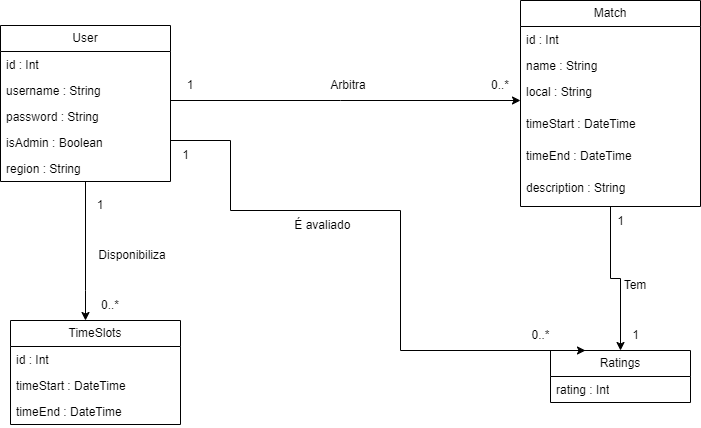

***

## Risk Plan

##### Threshhold of Success
- Till the end of the developing time limit, the app must include the 'Must Have' functionalities defined by the user stories.
- The app should give a good user experience.

##### Risk List
- RSK1 - PxI: 4x5=20; Due to external projects and exams and some team members having jobs, the team may have difficulty in implementing all features.
- RSK2 - PxI: 4x3=12; Inadequate understanding of user needs and preferences may lead to the development of features that do not provide a satisfactory user experience, since the team has no experience working together on projects of this size and using the 'SCRUM' methodology.
- RSK3 - PxI: 3x3=9; Due to potential compatibility issues in the project development arising from the technologies employed, errors in alignment with our planning may occur.
- RSK4 – PxI: 3x3=9; The team lacks prior experience in software estimation, posing a risk of potential underestimation that could lead to unanticipated project delays.
- RSK5 - PxI: 2x2=4; Members of the team have different schedules and may have difficulty in finding a time to meet.
- RSK6 - PxI: 1x3=3; The team may have difficulty in communicating seen as they have no previous experience collaborating and the 'SCRUM' methodology requires previous experience in order to be used effectively. That could lead to delays in the project.


##### Mitigation Actions
- RSK1 - MS; The team will try to organize the work so that everyone can contribute to the project, even if they have other commitments.
- RSK2 - AS; The team will try to always contact the product owner to clarify any doubts about the project, so that the team can work more efficiently.
***

## Pre-Game
### Sprint 0 Plan

- Goal: Planning the project
- Dates: from 13/Oct to 27/Oct, 2 weeks
- Sprint 0 Backlog (don't edit this list):
  - Task1 – Write Team
  - Task2 – Write V&S
  - Task3 – Write Requirements
  - Task4 – Write DoD
  - Task5 – Write Architecture&Design
  - Task6 – Write Risk Plan
  - Task7 – Write Pre-Game
  - Task8 – Write Release Plan
  - Task9 – Write Product Increments
  - Task10 – Create Product Board
  - Task11 – Create Sprint 0 Board
  - Task12 – Write US in PB, estimate (SML), prioritize (MoSCoW), sort
  - Task13 – Create repository with “GPS Git” Workflow
  - Task14 - Fix week 4 problems
  - Task15 - Update User Stories cards + Estimates (Story Points) + Priorities (MoSCoW)
  - Task16 - Plan Sprint 1
  - Task17 - Create Sprint 1 Board
  - Task18 - Create Sprint 1 Backlog (tasks+estimates+acceptance criteria)
  
## Release Plan

#### Release 1
- Goal: MVP - We want to have a functional application that allows referees to login and update their availability. Referees will be assigned to games automatically. Matches will be managed by the Manager and the application will also allow the Manager to add, modify, or remove matches from the system.
- Dates: [teams 0] 24/Nov
- Release: V1.0

***

#### Release 2
- Goal: Final release – The Manager will be able to create a new referee account and rate a referee after a match. The algorithm that assigns a referee to a match will be upgraded to select the best referee possible to that specific match based on their availability, level and location. The features related with referees payment will also be added to the app.
- Date: [teams 0+1] 15/Dec
- Release: V2.0

***

## Increments

### Sprint 1
##### Sprint Plan

- Goal: The goal of Sprint 1 is to create a basic functional application with the most important features. By the end of this sprint, we aim to have a login system, referee availability management, the ability to view upcoming matches, and the initial implementation of an automatic referee allocation algorithm.

- Dates: from 27/Oct to 10/Nov , 2  weeks

- Roles:
  - Product Owner: João Duarte
  - Scrum Master: Bruno Gomes

-Global Task:
  - Task1: Create database/API

- Sprint 1 Backlog:
  - US1: As a User, I want to be able to easily login on the application, so I can start using the system.
    - Task1: Create login UI
  - US2: As a referee, I want to update my availability by specifying time slots when I am free to officiate matches, so the system can assign me to suitable games.
    - Task1: Create referee panel UI (includes a table for the upcoming matches and a table to select the available time slots)
    - Task2: Create availability form
  - US6: As a Referee, I want to be able to view the upcoming matches, so I can make informed decisions when marking time slots as available.
    - Task1: Create 'matches' table
  - US12: As a Manager, I want to have an algorithm to automatically assign referees to matches based on their availability, level and ratings.
    - Task1: Create Manager Panel UI (includes a table for the upcoming matches and a table with all referees)
    - Task2: Create allocation algorithm
  
  

- Story Points: 2S+3M+3X+2H

- Analysis: short analysis of the planning meeting

##### Sprint Review

- Analysis: The team successfully implemented all the proposed functionalities for the sprint. Although the management and organization faced some challenges, continuous improvement each day aligned with the client's model, ultimately achieving a result that met the client's satisfaction.


- Story Points: Small: 3, Medium: 0, Large: 1; Total = 3S + 0M + 1L = 20S 0M 2L


- Version: 0.1


- Client analysis: The client accepted our release in its totality after some changes. We concluded that the client was satisfied with the delivered result.


- Conclusions: As a team, we collectively determined that the sprint aligned with our expectations and commitments to the client, delivering everything promised with some minor adjustments needed.

##### Sprint Retrospective

- What we did well:
  - All the proposed features were implemented
  - The team maintained a well-organized workflow, with each member dedicated to specific tasks in both coding, such as implementing features, and sprint management, which included updating issue boards, revising and enhancing sections of the README, and configuring GitLab functionalities like Milestones.
- What we did less well:
  - There were some initial uncertainties about how to structure the sprint plan on the issue boards, but these were promptly resolved by the conclusion of the sprint.
  - Some issues were not properly estimated, which led to a few tasks being completed later than expected.
- How to improve to the next sprint:
  - Improve the accuracy of issue estimates, based on the experience gained from this sprint.
  - Make sure that all team members have a clear understanding of the sprint plan and the tasks that need to be completed.

***

#### Sprint 2
##### Sprint Plan

- Goal: Add more features (described in MVP - Release 1) and update the existing ones as well as the UIs, for example adding a 'add' match button and display the username on the respective user panel.


- Roles:

  - Product Owner: João Santos
  - Scrum Master: André


- Dates: from 10/Nov | 24/Nov, 2 weeks


- Sprint 2 Backlog:
  - Task: Create a logout button
  - Task: Add the username on the respective user panel
  
  - US3: As a Manager, I want to be able to add matches to the system.
    - Task1: Create a form to add matches
  - US4: As a Manager, I want to be able to modify upcoming matches in the system.
    - Task1: Create a form to modify matches
  - US5: As a Manager, I want to be able to remove matches from the system.
    - Task1: Add a way to remove matches
  - US7: As a Manager, I want to be able to view the upcoming matches, so I can make informed decisions when managing the game.
    - Task1: Update then table to show the upcoming matches on Manager panel
    - Task2: Update the referee assignment to a match adding a button to assign and deassign on the Manager panel
  - US8: As a Manager, I want to be able to view the availability of a referee.
    - Task1: Add a way to check the referees availability after selecting a match


- Story Points: 2S+3M+3X+2H


- Analysis: short analysis of the planning meeting


##### Sprint Review


- Analysis: The team implemented all the proposed functionalities for this sprint. The team faced some individual challenges that were overcome with the help of the team. The team was able to deliver the sprint on time but missed on the estimates due to those difficulties.


- Story Points:  Small: 5, Medium: 0, Large: 0; Total = 5S + 0M + 0L = 24S 0M 0L


- Version: 0.1


- Client analysis: The client accepted our release in its totality. We concluded that the client was satisfied with the delivered result.


- Conclusions: The team overcame some difficulties and concluded the sprint on time.


##### Sprint Retrospective

- What we did well:
  - The team helped each other to overcome the difficulties.
  - The team exposed their doubts on some tasks almost daily so the team was always aware of the requirements for each task.


- What we did less well:
  - Some issues were not properly estimated, which led to a few tasks being completed earlier than expected.

- How to improve to the next sprint:
  - Improve the accuracy of issue estimates, based on the experience gained from this sprint.
***

#### Sprint 3
##### Sprint Plan

- Goal: Update the referee assignment code. Add some more features such as rate a referee after match and referee payment.


- Roles:

  - Product Owner: Bruno Gomes
  - Scrum Master: Leonardo Gomes


- Dates: from 24/11 | 15/12, 3 weeks


- Sprint 3 Backlog:
  - Task: Update the referee panel to show the referee rating (and not a random number)
  - US9: As a Manager, I want to rate a referees performance after every match to evaluate their performance, providing the system with weights to better allocate the referee.
    - Task1: Add a button to show finished matches on the Manager panel
    - Task2: Add a button to rate the referee of the selected match
  - US10: As a Manager, I want to be able to create referees accounts, so that referees can access the system.
    - Task1: Code the 'add' button on the referees table on manager panel
  - US11: As a Manager, I want to have the ability to disable referees accounts, so that referees who violate rules or guidelines are blocked from accessing the system.
    - Task1: Update the User table on database with a new column 'disabled'
    - Task2: Add and code a 'disable' button on manager panel
    - Task3: Add and code a 'enable' button on manager panel
  - US13: As a Manager, I want to be able to check how much a referee has to be payed at the end of the month, so I can make an informed decision when paying the referee.
    - Task1: Update the User table on database with a new column 'payment'
    - Task2: Add a button to check the referee payment on the manager panel
    - Task3: Add new 2 tables one to show the referee payment old ones and new ones, and another to controll the feeds.
  - US14: As a Referee, I want to be able to check how much I have earned this month and the previous one, so I can have an idea of how much money I have earned the past two months.
    - Task1: Create a new table on database with the referee payment history
  - US15: As a Manager I want to be able to delete a referee account in case of any error or if the referee is no longer part of the association.
    - Task1: Add and code a 'delete' button on manager panel


- Story Points: 2S+3M+3X+2H


- Analysis: 


Sprint Review


- Analysis: We added the US15 and respectives tasks: [User story 15](#user-story-15)


- Story Points: 2S+1M+2X+2H


- Version: 0.1


- Client analysis: client feedback


- Conclusions: what to add/review


Sprint Retrospective

What we did well:
- The team helped each other to overcome the difficulties.
- The team improved the accuracy of issue estimates, based on the experience gained from the previous sprints.


What we did less well:


***
